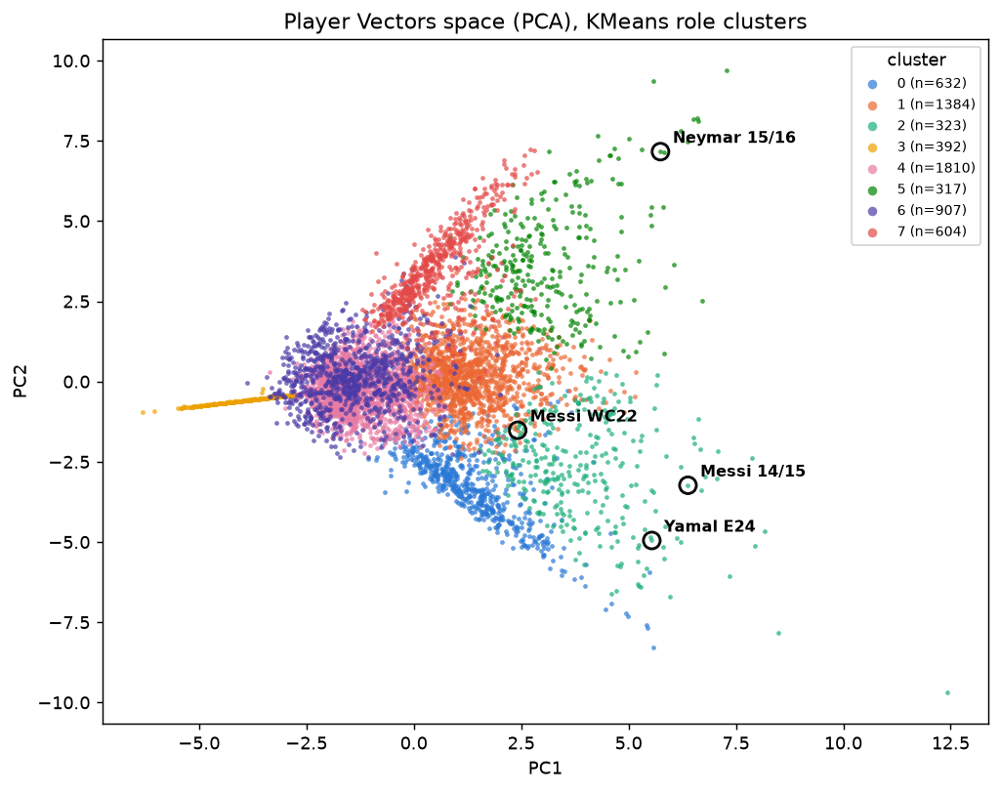

# Player Vectors baseline (Decroos & Davis 2019) — M4

Regenerated by `src/models/m1_player_vectors.py` on every `dvc repro`. Do not edit.

6,369 entities (>= 450 min) x 20 dims (4 NMF components x 5 action types, 24x16 per-90 smoothed heatmaps). Euclidean distance, per the paper. Volume is kept
(per-90 counts, not shares) — differences vs the cosine baseline are
informative, not bugs.

## Clusters (KMeans on standardized weights)

| cluster | n | position mix | exemplars (closest to centroid) |
|---|--:|---|---|
| 0 | 632 | DF 81%, MF 13% | Irribaria (Real Sociedad 2015/2016); Donati (Bayer Leverkusen 2015/2016); Walker (Tottenham Hotspur 2015/2016); Zaremba (Costa Adeje Tenerife 2023/2024); Eržen (Fiorentina W 2023/2024) |
| 1 | 1384 | FW 66%, MF 33% | Giménez (West Bromwich Albion FC 2017/2018); Inglese (Chievo 2015/2016); Defrel (Sassuolo 2015/2016); Calleri (UD Las Palmas 2017/2018); Visalli (West Ham United LFC 2018/2019) |
| 2 | 323 | FW 67%, MF 27% | Mead (Arsenal WFC 2020/2021); Redmond (Norwich City 2015/2016); Payne (Sevilla FC 2023/2024); Gil (Getafe 2015/2016); Zhar (Las Palmas 2015/2016) |
| 3 | 392 | GK 99%, DF 1% | Pacheco (Valencia CF 2023/2024); Lloris (Tottenham Hotspur 2015/2016); Tătărușanu (Fiorentina 2015/2016); Vaclík (Czech Republic 2020); Frohms (VfL Wolfsburg WFC 2023/2024) |
| 4 | 1810 | DF 54%, MF 36% | Balleste (CD Sporting de Huelva 2023/2024); Cho (West Ham United LFC 2020/2021); Marchi (SS Lazio 2017/2018); Oliver (CD Sporting de Huelva 2023/2024); Keane (Everton FC 2017/2018) |
| 5 | 317 | FW 70%, MF 26% | Marulanda (Colombia 2024); Benezet (Guingamp 2015/2016); Sterling (Manchester City 2015/2016); Nieto (Valencia CF 2023/2024); Inui (Eibar 2015/2016) |
| 6 | 907 | MF 67%, DF 32% | Ingle (Chelsea FCW 2018/2019); Rosa (Manchester City 2015/2016); Santamaría (Athletic Club Bilbao 2023/2024); Aranbarri (Athletic Club Bilbao 2023/2024); Ki (Swansea City 2015/2016) |
| 7 | 604 | DF 85%, MF 10% | Turner (Everton LFC 2019/2020); Peluso (Sassuolo 2015/2016); Worm (Tottenham Hotspur Women 2020/2021); Echiejile (AS Monaco 2015/2016); Moimbé (Nantes 2015/2016) |

## Case study: is Yamal/Neymar near Messi?

**query: Messi Barcelona 2014/2015** (cluster 2)

| target | cluster | rank | dist |
|---|--:|--:|--:|
| Neymar Barcelona 2015/2016 | 5 | 5674/6369 | 0.75 |
| Neymar Brazil 2018 | 5 | 5821/6369 | 0.77 |
| Lamine Spain 2024 | 2 | 38/6369 | 0.33 |

**query: Messi Argentina WC2022** (cluster 1)

| target | cluster | rank | dist |
|---|--:|--:|--:|
| Neymar Barcelona 2015/2016 | 5 | 6046/6369 | 0.59 |
| Neymar Brazil 2018 | 5 | 6030/6369 | 0.59 |
| Lamine Spain 2024 | 2 | 3705/6369 | 0.33 |

